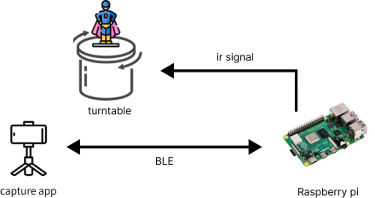
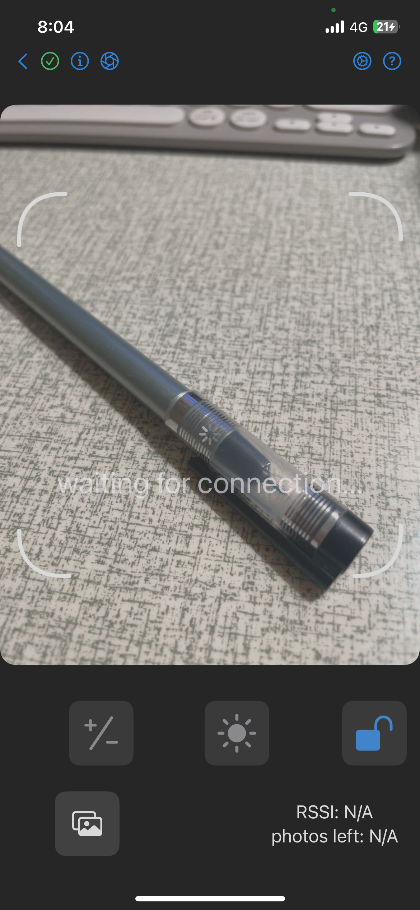
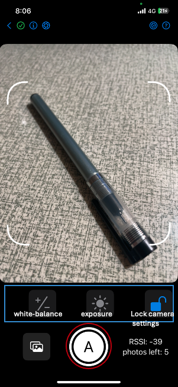

# Introduction
This project is installed and executed in Raspberry Pi. It coordinate with capture app and turntable to carry out capture process (see the diagram below). There are 2 kinds of capture process -- **fixed-angle** and **fixed-time-interval**.  

# How to use
1. Power on Raspberry Pi, and this program would be automatically executed and start adcvertising BLE service. (on branch ryan of capture_app)
  
2. To find Raspberry Pi with your capture app, first of all, make sure the bluetooth is opened on your phone, and then open the capture app. Press "New session" button. If the capture app is able to find Raspberry Pi, the UI of the app would turn from "connecting" state to "connected" state. (see the figure below, on branch ryan of capture_app) 

  
3. Configure the parameters of the capture process as you want by clicking the button with "setting" icon on the top-right corner. (on branch ryan of capture_app)  
4. You can adjust exposure and white-balance from the second bottom bar (illustrated in the blue frame). Remember this should be done **right before** starting shooting process, otherwise the exposure and white-balance would be reset as one navigates to other page.  
5. Tap on the camera button (illustrated in the red circle) to start the shooting process. Tapping on the camera button while shooting could stop the shooting process. 
  
6. Once the shooting process is done, press the thumbnail on the bottom-left corner, and you will see the capture gallery which has been made. Then clicking on the button with upload icon to upload. You may insert your capture name and decide whether to generate with this capture. 
